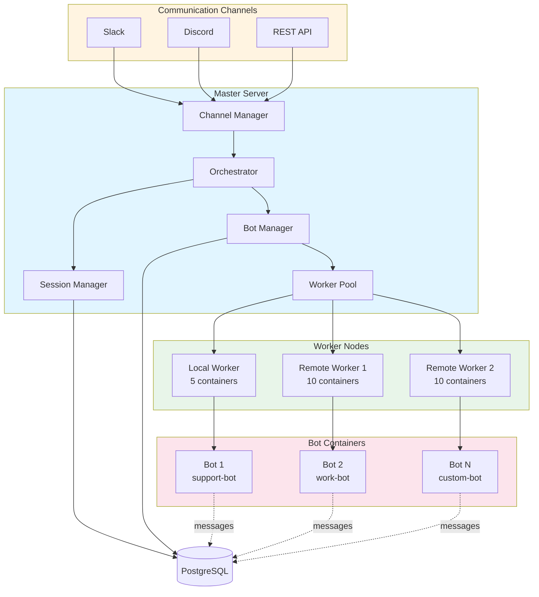

# AI Army

[](https://www.npmjs.com/package/ai-army)
[](https://nodejs.org)
[](https://github.com/developerz-ai/ai-army/actions)
[](LICENSE)

**A framework for building multi-bot AI systems with master/worker architecture and Docker isolation.**

Deploy specialized AI bots across distributed workers, each running in isolated containers with persistent memory and custom tools.

---

## ✨ Features

| Feature | Description |
|---------|-------------|
| 🤖 **Multi-Bot Architecture** | Run multiple specialized AI bots with unique personalities and tools |
| 🔧 **Docker Isolation** | Each bot runs in sandboxed containers with resource limits |
| 📡 **Multi-Channel Support** | Deploy bots to Slack, Discord, REST API, and custom channels |
| 🔌 **MCP Tool Integration** | Built-in support for Model Context Protocol tools |
| 💾 **Persistent Memory** | Conversation history with automatic summarization |
| 🌐 **Distributed Workers** | Scale across local and remote worker nodes via SSH |
| 🔄 **Hot Reload** | Update bot configs without downtime |
| 🔐 **Secret Management** | Secure secret interpolation from multiple providers |
| 📊 **PostgreSQL Backend** | Robust storage for sessions, queue, and audit logs |

---

## 🏗️ Architecture



**Key Components:**
- **Master**: Orchestrates message routing, session management, and worker coordination
- **Workers**: Execute bot containers with resource isolation and health monitoring
- **PostgreSQL**: Central data store for sessions, queue, bot registry, and audit logs
- **Channels**: Adapters for Slack, Discord, REST API, and custom integrations

---

## 🚀 Quick Start

```bash
# Install dependencies
npm install

# Configure your bots
cp config.example.json config.json

# Set up database
npx ai-army migrate

# Validate configuration
npx ai-army validate

# Start with Docker Compose (recommended)
docker-compose up -d

# Or start directly
npx ai-army start
```

**First bot in 30 seconds:**

```bash
# Create bot directory
mkdir -p bots/my-bot

# Create bot config
cat > bots/my-bot/config.json << 'EOF'
{
  "name": "My Bot",
  "model": "claude-sonnet-4-5",
  "channels": ["slack"],
  "tools": ["bash", "read_file"]
}
EOF

# Create personality
cat > bots/my-bot/soul.md << 'EOF'
You are a helpful AI assistant that helps developers with code.
EOF

# Register in config.json
npx ai-army validate

# Reload
npx ai-army reload my-bot
```

---

## 📖 Documentation

- **[Architecture Guide](docs/architecture.md)** - Master/worker design, data flow, scaling patterns
- **[Configuration Guide](docs/configuration.md)** - Bot configs, channels, workers, secrets
- **[Deployment Guide](docs/deployment.md)** - Docker, VPS, cloud deployment strategies
- **[Development Guide](docs/development.md)** - Contributing, testing, debugging

**Full documentation site:** [https://developerz-ai.github.io/ai-army](https://developerz-ai.github.io/ai-army)

---

## 📦 Example Bots

- **`support-bot`** - Customer support bot with ticketing integration
- **`work-bot`** - Productivity assistant with calendar and task management
- **`code-bot`** - Code review and debugging assistant

See [examples/](examples/) for more templates.

---

## 🔧 Configuration

Minimal `config.json`:

```json
{
  "bots": [
    {
      "id": "assistant",
      "name": "Assistant",
      "personality": "bots/assistant/soul.md",
      "model": "claude-sonnet-4-5",
      "channels": ["slack"],
      "tools": ["bash", "read_file", "write_file"]
    }
  ],
  "channels": {
    "slack": {
      "token": "${SLACK_BOT_TOKEN}",
      "signingSecret": "${SLACK_SIGNING_SECRET}"
    }
  },
  "database": {
    "url": "${DATABASE_URL}"
  },
  "workers": [
    {
      "id": "local",
      "type": "local",
      "maxContainers": 5
    }
  ]
}
```

See [Configuration Guide](docs/configuration.md) for all options.

---

## 🤝 Contributing

We welcome contributions! Please see:
- [CONTRIBUTING.md](CONTRIBUTING.md) - Guidelines and workflow
- [Development Guide](docs/development.md) - Setup and testing
- [CHANGELOG.md](CHANGELOG.md) - Version history

---

## 📄 License

MIT © [Developerz AI](https://github.com/developerz-ai)

See [LICENSE](LICENSE) for details.

---

## 🔗 Links

- **Documentation**: [https://developerz-ai.github.io/ai-army](https://developerz-ai.github.io/ai-army)
- **npm Package**: [https://www.npmjs.com/package/ai-army](https://www.npmjs.com/package/ai-army)
- **GitHub**: [https://github.com/developerz-ai/ai-army](https://github.com/developerz-ai/ai-army)
- **Issues**: [https://github.com/developerz-ai/ai-army/issues](https://github.com/developerz-ai/ai-army/issues)

---

**Built with ❤️ by the Developerz AI team**
